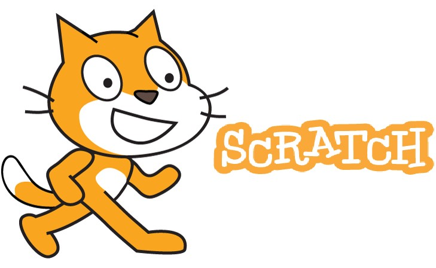

# Learning Scratch

| Track the learning and practicing journey of Scratch language |  |
| --- | --- |

## Books on Learning

- [Scratch for Kids](scratch4kids/README.md)
- Scratch Programming Playground
- Coding Games in Scratch
- Super Scratch Programming Adventure - Learn to Program
- Computer Coding Projects for Kids
- Learn to Programe with Scratch
- Scratch by Examples
- Coding Projects in Scratch
- Scratch by Example

---

Welcome to hear from you, please drop me your questions to my [Email](mailto:xiaoqizhao@outlook.com) here, or leave comments under specific videos. Good Luck!